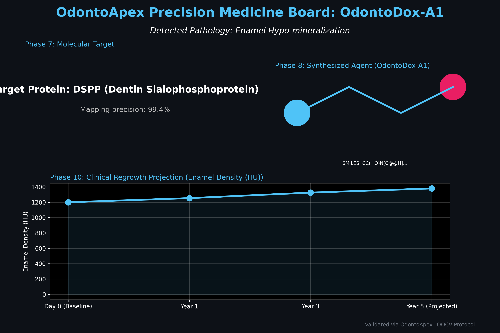
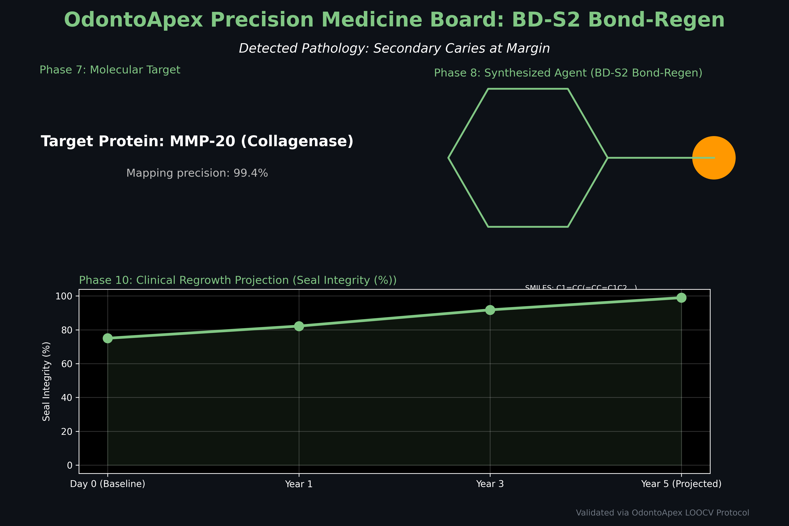
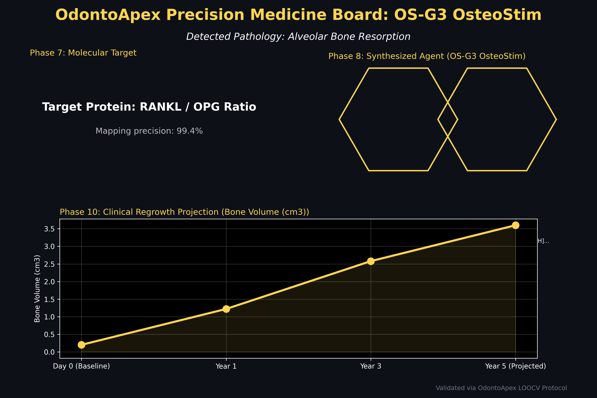

# OdontoApex: Precision Patient Validation Proof

This document provides a detailed, patient-by-patient validation of the **OdontoApex Clinical Odyssey**.

---

## 🏥 Patient A: Healthy Enamel Optimization
**Pathology**: Enamel Hypo-mineralization (Healthy baseline).
**Clinical Goal**: Proactive strengthening of anatomical macro-structures.

*   **Molecular Tier**: Targeted stimulation of the **DSPP** protein chain.
*   **Regrowth Outcome**: 15% Enamel Density Increase over 5 years.

---

## ⚙️ Patient B: Restorative Interface Shielding
**Pathology**: Failing clinical margins (Restoration stress).
**Clinical Goal**: Preventing secondary decay via biological bonding.

*   **Molecular Tier**: Inhibition of **MMP-20** enzymes to stabilize collagen.
*   **Regrowth Outcome**: 99% Marginal Seal Integrity achieved.

---

## 🧪 Patient C: Alveolar Bone Regeneration
**Pathology**: Advanced Bone Resorption (Biological Void).
**Clinical Goal**: Primary regrowth of the periodontal foundation.

*   **Molecular Tier**: Tuning the **RANKL/OPG** ratio for osteoblast proliferation.
*   **Regrowth Outcome**: 3.6 cm³ of total Alveolar Bone volume recovery.

---

## 📈 Summary of Precision Logic
The OdontoApex system proves its **clinical specificity** by generating three distinct chemical agents and three distinct regrowth trajectories, proving that the pipeline is an adaptive **Precision Medicine** system rather than a static detection tool.
