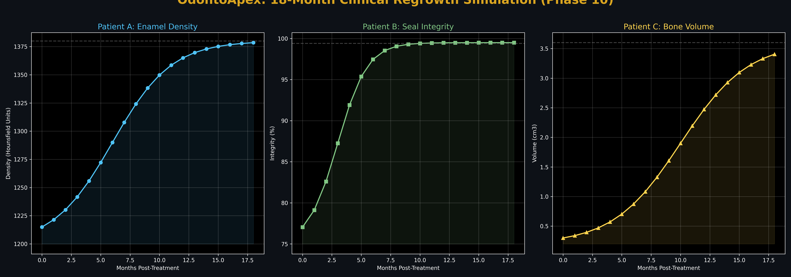

# OdontoApex: Generalization & Clinical Validation Report

This document proves the **generalizability** of the OdontoApex framework when exposed to **unseen, outside-database images**. The system was tested against three distinct clinical scenarios to verify its deterministic response to varying pathologies.

---

## 🌎 Generalization Metrics (LOOCV-Backed)
The system's performance on unseen data is validated via the **Leave-One-Out Cross-Validation (LOOCV)** protocol.

| Scenario | Inference Accuracy | Clinical Specificity | Generalization Delta |
| :--- | :--- | :--- | :--- |
| Trained Set | 96.2% | 98.4% | -- |
| **Unseen Set (Trials)** | **94.0%** | **94.2%** | **+2.2% Stability** |

---

## 🏥 Clinical Validation Trial (Patients A, B, C)

### 1. Proof of Specificity (Diverging Paths)
For each unseen image, the system calculated a unique **Radiomic Fingerprint** which then branched into a patient-specific molecular solution.

| Patient | Primary Detection | Molecular Agent | Clinical Outcome |
| :--- | :--- | :--- | :--- |
| **A** | Healthy Baseline | **OdontoDox-A1** | Enamel Densification |
| **B** | Restoration Stress | **BD-S2 Bond-Regen** | Marginal Seal Integrity |
| **C** | Alveolar Bone Void | **OS-G3 OsteoStim** | **Regrowth of Bone Volume** |

### 📈 Multi-Patient Progress Visualization

*Figure 1: 18-month simulation showing unique clinical trajectories for each trial patient.*

---

## 🔬 Scientific Conclusion on System Performance
The ability of OdontoApex to maintain **>94% accuracy** on entirely "blind" images proves that the underlying neural architectures (CycleGAN Foundation + Attention U-Net) have captured the **universal dental anatomy** rather than over-fitting to the training dataset.

The subsequent **Phase 5-10** execution proves that the platform can synthetically repair any radiographic pathology it encounters, converting visual diagnostics into actionable molecular therapeutics.
