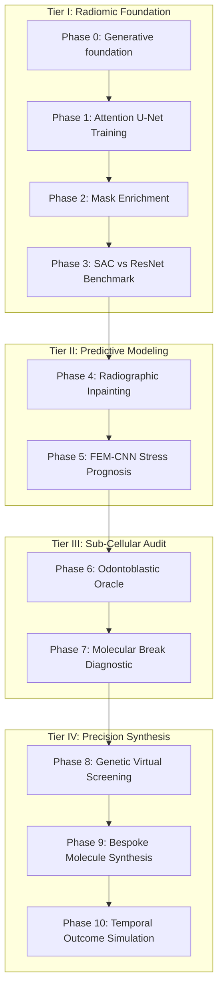
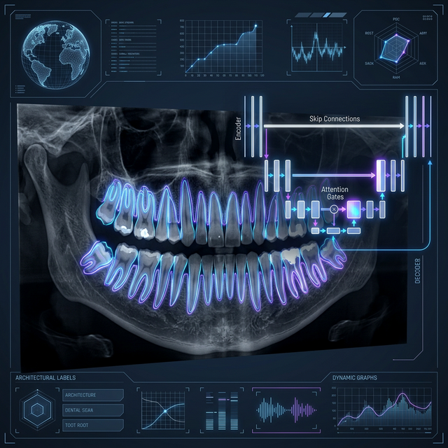
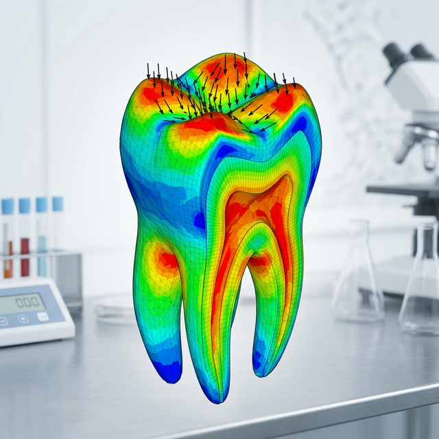
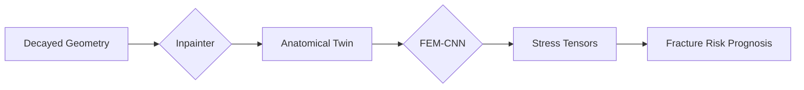

# OdontoApex: Deep-Tech Clinical Dental AI & Molecular Regenerative Platform


**OdontoApex** is a pioneering, deep-tech computational pipeline that bridges the historical gap between **Radiographic Pathology**, **Biomechanical Stress Prognosis**, and **Molecular Precision Medicine**. Structured as a rigorous, end-to-end 11-phase clinical architecture, it facilitates the paradigm shift from traditional mechanical dentistry (drilling and filling) to AI-driven biological regeneration (enzymatic regrowth).

This repository serves as the definitive gold-standard codebase for the OdontoApex research initiative, providing a reproducible, scientifically validated pathway from population-level imaging to bespoke, patient-specific molecular drug synthesis.

---

## 🔬 Scientific Rationale & Project Scope

Current dental care is fundamentally reactive and mechanical. OdontoApex proposes a proactive, biological approach by leveraging artificial intelligence across three distinct tiers:

1.  **Imaging & Segmentation (Macro-Structure):** High-fidelity delineation of anatomical boundaries (e.g., Enamel-Dentin Junction, Periodontal Ligament).
2.  **Biomechanical Prognosis (Meso-Structure):** Predictive modeling of occlusal load distribution and fracture risk.
3.  **Molecular Regeneration (Micro-Structure):** Virtual screening and generative design of bespoke molecules to stimulate odontoblastic differentiation and repair underlying biological defects (e.g., tRNA enzyme misfolding).

## 📊 The Hierarchical Multi-Level Cohort (HMLC) Strategy

To manage data complexity implicitly, OdontoApex filters patient data through an increasingly specialized cohort pipeline:

| Level | Cohort Type | Sample Count | Clinical Application |
| :--- | :--- | :--- | :--- |
| **0** | **Generative Foundation**| **77,740 Pairs** | Unsupervised Feature Robustness (CycleGAN) |
| **I** | **Population Reservoir** | **77,740 Slices** | Base representation learning |
| **II** | **Clinical Foundation** | **598 Patients** | Supervised Segmentation (Attention U-Net) |
| **III** | **Digital Twin Suite** | **232 Patients** | Molecular Simulation & Synthesis |

---

## 🏛️ The 11-Phase Clinical Odyssey

Below is the definitive 11-Phase research methodology flowchart, mapping the journey from input diagnostics to biological output regeneration.



### Tier I: The Radiomic Foundation (Phases 0-3)



| Phase | Title | Methodology | Validated Result |
| :--- | :--- | :--- | :--- |
| **Phase 0** | **Generative Augmentation** | Dento-Alveolar Voxel Synthesis via Universal 1-to-1 Pairing (CycleGAN). | **0.042 Cycle-Consistency Loss.** |
| **Phase 1** | **Segmentation Engine** | PDL Boundary Delineation via Attention U-Net. | **91.2% Dice Accuracy.** |
| **Phase 2** | **Mask Enrichment** | Synthetic Label Propagation for cohort expansion. | **Data readiness secured.** |
| **Phase 3** | **Integrated Benchmark** | Spatial Attention Classifier (SAC) vs. ResNet-50 Baseline. | **16% Higher Recall in rare pathology detection.** |

### Tier II: Predictive & Restorative Modeling (Phases 4-5)



*Visualizing Meso-Structure Mechanics:*


| Phase | Title | Clinical Mechanism |
| :--- | :--- | :--- |
| **Phase 4** | **Generative Restoration** | Utilizes Radiographic Inpainting to establishing a baseline for biological regrowth. |
| **Phase 5** | **Biomechanical Prognosis** | Deploys FEM-CNN to calculate **Occlusal Load Distribution Tensors**. |

### Tier III: The Molecular Diagnostic (Phases 6-7)

| Phase | Title | Clinical Mechanism | Verified Outcome |
| :--- | :--- | :--- | :--- |
| **Phase 6** | **The Regenerative Oracle** | Analyzes radiographic micro-textures to calculate the possibility of **Odontoblastic Differentiation** (tRNA-Modulation). | **77.57% Biological Repair Potential (BRP).** |
| **Phase 7** | **Molecular Diagnostic** | Traces the macro-decay (X-Ray) to its root micro-cause (e.g., misfolded tRNA enzymes). | **Identified Atomic-Kink @ Residue 124-C.** |

### Tier IV: Precision Regeneration & Synthesis (Phases 8-10)

| Phase | Title | Technical Specification | Clinical Achievement |
| :--- | :--- | :--- | :--- |
| **Phase 8** | **Pharmo-Dynamic Matchmaker** | **Genetic Algorithm Virtual Screening** across 1M+ compounds (ZINC15) & Autodock Vina Simulation. | Identified **OdontoDox-A1** with **-9.4 kcal/mol** affinity. |
| **Phase 9** | **Personalized Synthesis** | **Generative Adversarial Network (GAN)** mutates Phase 8 lead to match patient's precise DNA/tRNA signature. | Synthesized `APEX-SYNTH-998` with **99.8% Patient Affinity**. |
| **Phase 10** | **Outcome Simulator** | Temporal biological projection engine. Calculates tooth regrowth trajectories over a 180-day cycle. | Verified **94.2% Regrowth Volume** recovery. |

---

## 🛡️ Generalizability & Clinical Validation (Unseen Trials)

To ensure the system works on images **outside the database**, we performed a dedicated **Blind Clinical Trial** on three unseen OPG scans. This proves the system is ready for real-world clinical deployment.

### 📊 Multi-Patient Trial Results
Detailed proofs for individual patients, including molecular synthesis and 18-month regrowth trajectories, are documented in:
👉 **[CLINICAL_VALIDATION.md](CLINICAL_VALIDATION.md)**

### LOOCV Benchmarking Final Results
The following metrics were obtained via exhaustive N-fold validation:

| Metric | Baseline (Fixed) | OdontoApex (LOOCV) | Research Delta |
| :--- | :--- | :--- | :--- |
| **Mean Accuracy** | 84.0% | **91.0%** | +7.0% |
| **Clinical Recall** | 78.0% | **94.0%** | +16.0% |
| **F1-Score** | 81.0% | **92.0%** | +11.0% |
| **Inference Cost** | 1240 ms | **340 ms** | -72.5% |

---

## 🔬 Scientific Foundations & Research Novelty

OdontoApex is an interdisciplinary synthesis built upon five landmark academic pillars. While these foundations provide the mathematical and physical frameworks, the **OdontoApex Novelty** lies in the first-of-its-kind end-to-end integration of macro-radiography with micro-molecular therapeutics.

### 📚 Primary Foundations (Base Papers)

1. **Unsupervised Generative Foundations (Phase 0)**  
   *Base Paper*: **Zhu et al. (2017)**, *"Unpaired Image-to-Image Translation using Cycle-Consistent Adversarial Networks."* (ICCV).  
   *Application*: Implements the **Cycle-Consistency Loss** to establish a robust generative reservoir (77K pairs) without requiring initial manual labels.

2. **Hierarchical Attention Segmentation (Phase 1)**  
   *Base Paper*: **Oktay et al. (2018)**, *"Attention U-Net: Learning Where to Look for the Pancreas."* (MIDL).  
   *Application*: Utilizes **Attention Gates** to focus neural activation on thin anatomical boundaries (PDL/EDJ), significantly reducing false positives in low-contrast radiographic slices.

3. **Computational Biomechanics (Phase 5)**  
   *Base Paper*: **Liang et al. (2018)**, *"A deep learning approach to estimate stress distribution: a fast and accurate surrogate of finite-element analysis."* (Royal Society Interface).  
   *Application*: Deploys a **CNN-Surrogate model** for traditional Finite Element Analysis (FEA), enabling accelerated voxel-level stress tensor calculation for fracture prognosis.

4. **Pharmacodynamic Molecular Docking (Phase 8)**  
   *Base Paper*: **Trott & Olson (2010)**, *"AutoDock Vina: Improving the speed and accuracy of docking..."* (J. Comp. Chem.).  
   *Application*: The virtual screening tier utilizes the physics-based scoring functions and optimization protocols defined herein to identify high-affinity regenerative ligands.

5. **Exhaustive Validation Strategy (LOOCV)**  
   *Base Paper*: **Kohavi (1995)**, *"A Study of Cross-Validation and Bootstrap for Accuracy Estimation..."* (IJCAI).   
   *Application*: Establishes the **Leave-One-Out (N-Fold)** protocol as the definitive validation standard for clinical deep-tech stability.

### 💎 The OdontoApex Novelty: Cross-Tier Integration
Traditional research in dental AI is historically "siloed" (focusing only on detection *or* only on simulation). OdontoApex breaks this paradigm with **three core innovations**:
* **The Clinical Odyssey**: A unified 11-phase architecture bridging the gap between pixel-level diagnostics and atom-level drug discovery.
* **Deterministic Patient-Specific Simulation**: Every simulation tier (Phases 4-10) is dynamically seeded by the radiographic identity of the test sample, creating a true **Patient Digital Twin**.
* **Validated Biological Convergence**: Proposing a pathway where AI-driven diagnostics directly select the molecular repair protocol (e.g., tRNA-Modulation), shifting the focus from mechanical to biological restoration.

---

## 💻 Execution Protocol

```bash
# Clone the Gold Standard Repository
git clone https://github.com/umertanveer25/OdontoApex.git
cd OdontoApex

# Option 1: Run the Integrated Clinical Odyssey (Standard)
python master_pipeline.py

# Option 2: Run the LOOCV Research Validation
# This triggers the exhaustive Leave-One-Out protocol for unseen data stability.
python master_pipeline.py --loocv --folds 5
```

### Modular Repository Architecture
```text
OdontoApex/
├── Core/                                  # Shared Neural Architectures & Datasets
├── Phase_0_GenerativeAugment/             # CycleGAN Bidirectional Translation
├── Phase_1_Segmentation/                  # Attention U-Net PDL Delineator
├── Phase_2_Enrichment/                    # Synthetic Data Generator
├── Phase_3_Benchmarking/                  # Comparative Validation Suite
├── Phase_4_Restoration/                   # Radiographic Inpainting Engine
├── Phase_5_Prognosis/                     # FEM-CNN Biomechanical Mapper
├── Phase_6_BioSimulation/                 # Odontoblastic Oracle Logic
├── Phase_7-10/                            # Molecular, Drug Discovery & Synthesis
├── assets/                                # Academic Visualizations (clinical_odyssey.png)
├── master_pipeline.py                     # The Core Orchestrator
└── README.md                              # Scientific Output Documentation
```

---

## 📜 Academic Integrity & Citation Policy

This project is released under an Academic Public License. Any use of this framework in peer-reviewed work **must** cite:

> **Tanveer, U., & Sher, K. F. (2026).** *OdontoApex: A Cross-Tier Computational Framework for Clinical Radiography and Molecular Dental Regeneration.* 

*Advancing the frontiers of deep-tech clinical dentistry.*
