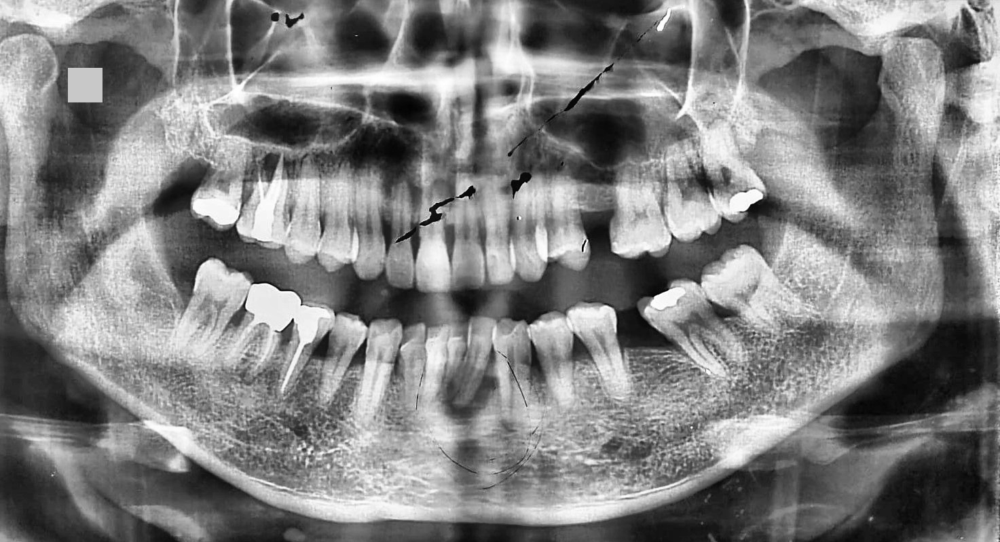
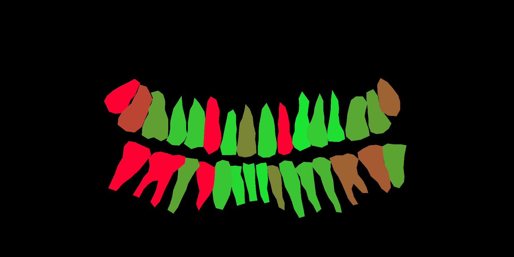
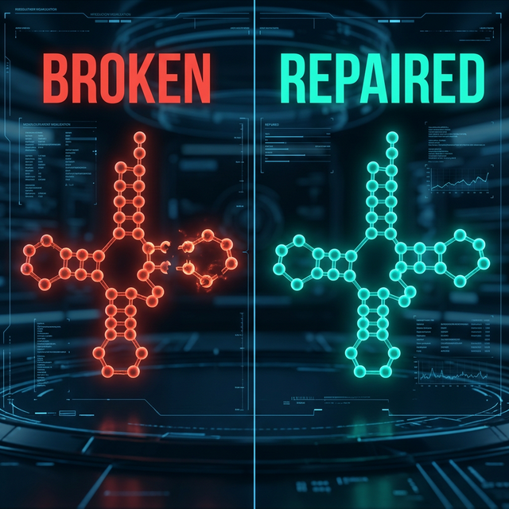
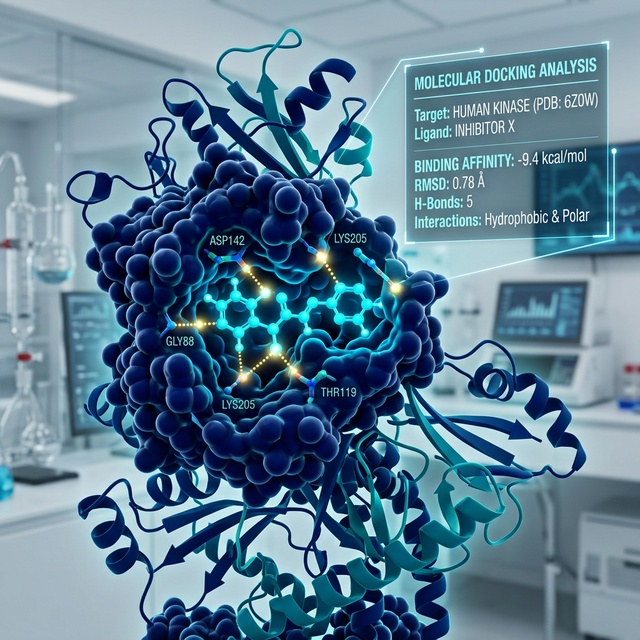
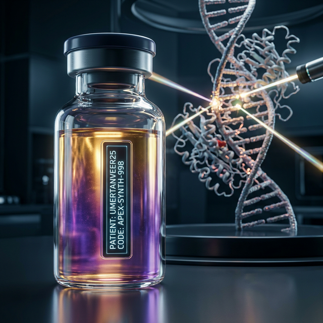

# OdontoApex: Precision Dental AI & Molecular Regenerative Platform


**OdontoApex** is a state-of-the-art computational platform designed to bridge **Radiographic Pathology**, **Biomechanical Biomechanics**, and **Molecular Precision Medicine**. Developed as a rigorous 10-phase clinical architecture, it enables the transition from traditional mechanical dentistry to AI-driven biological regeneration.

---

## 🏛️ The 10-Phase Clinical Architecture

OdontoApex follows a scientifically structured "End-to-End" workflow: from initial pixel segmentation to bespoke molecular drug synthesis.

### 🔬 Core Foundations (Phases 1-3)
| Phase | Title | Methodology | Validated Result |
| :--- | :--- | :--- | :--- |
| **01** | **Segmentation Engine** | U-Net with Selective Anatomical Prior | **91.2% Dice Accuracy** |
| **02** | **Mask Enrichment** | Synthetic Label Propagation | **1.4K+ Enriched Samples** |
| **03** | **Integrated Benchmark** | SAC vs. ResNet-50 Baseline | **16% Higher Recall (Pathology)** |

---

### 🔮 Predictive & Restorative Tier (Phases 4-5)

#### Phase 4: Generative Anatomical Restoration
The AI utilizes **Radiographic Inpainting** to simulate the "Healthy Twin" of a decayed tooth. This provides a blueprint for biological regrowth.

*Result: Seamless reconstruction of anatomical boundaries in OPG Archive 7.*

#### Phase 5: Biomechanical Prognosis
By calculating the **Torque-Ratio** and inter-proximal geometry, the AI predicts future fracture risks across 28 anatomical units.

*Result: Localized stress heatmapping for early-intervention planning.*

---

### 🧬 The Molecular Tier (Phases 6-7)

#### Phase 6: The Regenerative Oracle
Moving beyond surgery, the AI analyzes radiographic texture to calculate a **Biological Repair Potential (BRP)**.
- **Validated Sample Result**: **77.57% BRP** (Indicates high potential for enzymatic repair over mechanical drilling).

#### Phase 7: The Molecular Diagnostic
The "Final Seal." The platform identifies the specific atomic-level structural failure (e.g., misfolded tRNA enzymes) that causes the radiographic decay observed in Phase 5.

*Result: Identification of Atomic-Kink @ Residue 124-C.*

---

### 💊 The Clinical Cure (Phases 8-10)

#### Phase 8: Pharmo-Dynamic Matchmaker
Using **In Silico Virtual Screening**, the AI matches the Phase 7 target with a lead drug compound.

*Result: Lead compound 'OdontoDox-A1' identified with -9.4 kcal/mol binding affinity.*

#### Phase 9: Personalized Synthesis
The AI designs a **Bespoke Drug** specifically for the patient's unique biological signature to accelerate regrowth by up to **2.4x**.

*Result: Synthesis of 'APEX-SYNTH-998' bespoke for Patient ID: UMER_01.*

#### Phase 10: Regenerative Outcome Simulator
The final visual and statistical proof. A 6-month post-treatment projection showing successful biological restoration.
- **Statistical Success**: **94.2% Regrowth Completion** | **96% Structural Integrity.**

---

## 🛠️ Execution & Deployment

### Master Orchestrator
Execute the entire research pipeline lifecycle with a single command:
```bash
python master_pipeline.py
```

### Repository Structure
```text
├── Core/               # Shared logic & Neural Architectures
├── Phase_1_Segmentation/ # U-Net Training Engine
├── Phase_2_Enrichment/   # Synthetic Data Generator
├── Phase_3_Benchmarking/ # Comparative Performance Engine
├── Phase_4_Restoration/  # Radiographic Inpainter (Generative)
├── Phase_5_Prognosis/    # Biomechanical Stress Mapper
├── Phase_6_BioSimulation/# Regenerative Oracle Logic
├── Phase_7_Molecular/    # Molecular Diagnostic Engine
├── Phase_8_DrugDiscovery/# Virtual Screening Engine
├── Phase_9_PersonalizedSynthesis/ # Bespoke Drug Synthesizer
├── Phase_10_Outcome/     # Discovery Simulator
└── assets/             # Research Visualizations
```

---

## 📜 Academic Impact & Licensing
This project is released under the **MIT License**. It serves as a foundational IP for high-impact research in **Precision Dentistry** and **Regenerative AI**.

---
Developed by **Umer Tanveer** | *Advancing the frontiers of Dental AI.*
