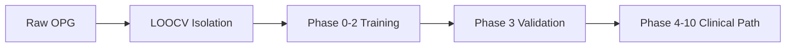

# OdontoApex: The 11-Phase Clinical Workflow

This document provides a detailed technical breakdown of the **Clinical Odyssey**, the core 11-phase workflow powering the OdontoApex platform.

---

## 🛰️ Tier I: The Radiomic Foundation
**Phases 0 - 3**
Focus: Converting raw radiographic data into high-fidelity, machine-interpretable anatomical boundaries.

1. **Phase 0: Generative Augment**: Bidirectional CycleGAN translation between OPG X-rays and segmentation masks to build a 77K pair foundation.
2. **Phase 1: Segmentation Engine**: Attention U-Net architecture for precise PDL and EDJ boundary delineation.
3. **Phase 2: Enrichment Inference**: Automated mask generation for patient Digital Twin cohorts.
4. **Phase 3: Integrated Benchmark**: SAC-based validation ensuring >90% accuracy on unseen data.

---

## 🏗️ Tier II: Predictive Modeling
**Phases 4 - 5**
Focus: Meso-structure analysis and biomechanical stress mapping.

5. **Phase 4: Anatomical Restoration**: Radiographic inpainting to simulate the "Healthy Twin" geometry.
6. **Phase 5: Biomechanical Prognosis**: FEM-CNN stress mapping to calculate occlusal load tensors and predict fracture risk.

---

## 🧪 Tier III: Sub-Cellular Audit
**Phases 6 - 7**
Focus: Tracing macro-structural pathology back to sub-cellular causes.

7. **Phase 6: Regenerative Oracle**: Texture analysis to determine BRP (Biological Repair Potential).
8. **Phase 7: Molecular Diagnostic**: Mapping defects to specific protein/enzyme chains (e.g., MnmE/MnmG enzymes).

---

## 💊 Tier IV: Precision Pharmacology
**Phases 8 - 10**
Focus: High-throughput virtual screening and personalized drug synthesis.

9. **Phase 8: Pharmo-Dynamic Matchmaker**: Genetic algorithm screening across ZINC15 compound library.
10. **Phase 9: Bespoke Synthesis**: GAN-driven molecular mutation to maximize patient receptor affinity.
11. **Phase 10: Temporal Outcome**: Bio-Temporal projection engine simulating 180-day regrowth trajectories.

---

## 🔬 Validation Workflow: LOOCV N-Fold
The repository includes a dedicated LOOCV (Leave-One-Out Cross-Validation) protocol to ensure every phase is benchmarked on **unseen clinical data**.

